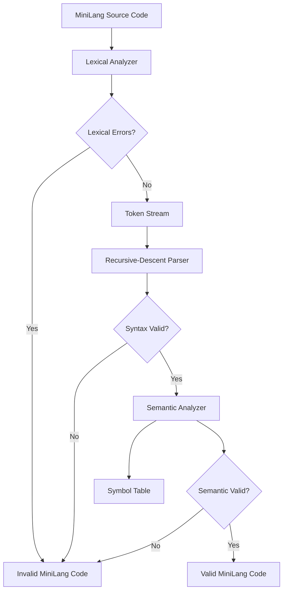

<div align="center">

# ⚙️ MiniLang Compiler Front-End

### From Automata Theory to a Working Compiler Pipeline

**A compact, interactive compiler front-end built with Python, DFA-inspired lexical analysis, CFG-based recursive-descent parsing, semantic validation, automated tests, and Streamlit visualizations.**

<br>

[](https://www.python.org/)
[](https://streamlit.io/)
[](https://graphviz.org/)
[](#automata-concepts)
[](#minilang-grammar)
[](#testing)
[](#academic-context)

<br>

[](https://github.com/builtbyrehan/minilang-automata-compiler-front-end/stargazers)
[](https://github.com/builtbyrehan/minilang-automata-compiler-front-end/forks)
[](https://github.com/builtbyrehan/minilang-automata-compiler-front-end)
[](https://github.com/builtbyrehan/minilang-automata-compiler-front-end/commits/main)
[](https://github.com/builtbyrehan/minilang-automata-compiler-front-end/graphs/contributors)

<br>

[Overview](#overview) •
[Features](#key-features) •
[Quick Start](#quick-start) •
[Grammar](#minilang-grammar) •
[Testing](#testing) •
[Architecture](#compiler-architecture) •
[Roadmap](#roadmap)

</div>

---

## Overview

**MiniLang** is an educational compiler front-end that demonstrates how formal-language and automata concepts are applied in compiler construction.

The project accepts source code written in a small custom language and processes it through three core compiler phases:

1. **Lexical analysis** converts characters into tokens through DFA-like scanning.
2. **Syntax analysis** validates the token stream using a context-free grammar and recursive-descent parsing.
3. **Semantic analysis** checks declaration and usage rules through a symbol table.

The same compiler engine is available through:

- a polished **Streamlit web interface**;
- an interactive **terminal application**;
- an **automated test runner**;
- Graphviz **DFA, pipeline, token-stream, and symbol-table visualizations**.

> MiniLang is intentionally small. Its purpose is to make the relationship between automata theory, formal grammars, parsing, and semantic validation visible and easy to explore.

---

## Why This Project Stands Out

- **Theory becomes executable:** DFA and CFG concepts are implemented as a working compiler pipeline.
- **Phase-aware diagnostics:** lexical, syntax, and semantic failures are reported separately.
- **Precise source locations:** errors include line and column information.
- **Interactive learning:** the Streamlit interface exposes tokens, grammar rules, symbol tables, and visual diagrams.
- **Reliable verification:** valid and invalid programs are evaluated through an automated test suite.
- **Modular design:** the lexer, parser, semantic analyzer, test runner, UI, and visualizer are separated into focused modules.

---

## Demo at a Glance

### MiniLang input

```c
int marks = 85;

if marks > 50 {
    print(marks);
}
```

### Compiler outcome

```text
Lexical Analysis:  Passed
Syntax Analysis:   Passed
Semantic Analysis: Passed

Compilation Successful
Result: Valid MiniLang Code
```

### Example token stream

```text
KEYWORD      int       line 1, column 1
IDENTIFIER   marks     line 1, column 5
OPERATOR     =         line 1, column 11
NUMBER       85        line 1, column 13
SEMICOLON    ;         line 1, column 15
```

---

## Key Features

### Lexical Analyzer

The lexer scans the input character by character and recognizes:

| Category | Supported values |
|---|---|
| Keywords | `int`, `if`, `print` |
| Identifiers | `x`, `marks`, `total_1` |
| Numbers | non-negative integer literals |
| Assignment | `=` |
| Arithmetic operators | `+`, `-`, `*`, `/` |
| Relational operators | `>`, `<` |
| Symbols | `;`, `(`, `)`, `{`, `}` |
| Whitespace | spaces, tabs, and new lines |

It also detects invalid identifiers such as:

```c
int 3marks = 85;
```

### Syntax Analyzer

The parser is a hand-written recursive-descent parser that validates declarations, assignments, print statements, conditions, expressions, and `if` blocks.

Example syntax error:

```c
int marks = 85
```

```text
Syntax Error at line 1, column 15:
Missing semicolon ';' after statement.
```

### Semantic Analyzer

The semantic analyzer builds a symbol table and enforces rules such as:

- variables must be declared before assignment;
- variables must be declared before use;
- variables cannot be declared more than once;
- printed variables must already exist;
- variables used in conditions and expressions must already exist;
- all MiniLang variables currently use the `int` type.

Example semantic error:

```c
score = 90;
```

```text
Semantic Error at line 1, column 1:
Cannot assign to variable 'score' because it has not been declared.
```

### Symbol Table

For every valid declaration, the compiler records:

| Field | Meaning |
|---|---|
| Variable | Identifier name |
| Type | Current MiniLang type (`int`) |
| Declared line | Source line containing the declaration |
| Declared column | Starting column of the identifier |
| Initialized | Whether an initial value was assigned |

### Interactive Streamlit Interface

The web interface includes:

- a MiniLang code editor;
- numbered token-stream tables;
- separate lexical and syntax reports;
- symbol-table output;
- semantic diagnostics;
- final phase-by-phase compilation status;
- formal grammar rules;
- supported syntax examples;
- compiler-flow explanations;
- lexer DFA visualization;
- compiler-pipeline visualization;
- token-stream visualization;
- symbol-table visualization.

### Automated Testing

The test runner:

- loads valid and invalid programs from text files;
- executes every compiler phase;
- classifies the phase that detected each error;
- records symbol-table output;
- calculates passed and failed counts;
- writes a complete report to `Test_Cases/test_results.txt`.

---

## Compiler Architecture



### Module responsibilities

| Module | Responsibility |
|---|---|
| `lexer.py` | Character scanning, token generation, lexical errors |
| `parser.py` | CFG validation and recursive-descent syntax analysis |
| `semantic_analyzer.py` | Symbol-table construction and semantic checks |
| `grammar.py` | Formal MiniLang production rules |
| `error_handler.py` | Structured and string-based error formatting |
| `main.py` | Terminal-based compiler runner |
| `app.py` | Streamlit web application |
| `test_runner.py` | Automated valid/invalid test execution |
| `visualizer.py` | Graphviz DOT generation and Streamlit diagrams |

---

## Automata Concepts

### Deterministic Finite Automaton

The lexical analyzer follows DFA-like state transitions to recognize token classes.

\[
M = (Q, \Sigma, \delta, q_0, F)
\]

| Symbol | Meaning |
|---|---|
| \(Q\) | Finite set of states |
| \(\Sigma\) | Input alphabet |
| \(\delta\) | Transition function |
| \(q_0\) | Initial state |
| \(F\) | Set of accepting states |

The practical scanner recognizes identifiers, keywords, numbers, operators, separators, whitespace, invalid numeric identifiers, and unknown symbols.

### Context-Free Grammar

The syntax analyzer validates program structure using a CFG.

\[
G = (V, \Sigma, P, S)
\]

| Symbol | Meaning |
|---|---|
| \(V\) | Non-terminal symbols |
| \(\Sigma\) | Terminal symbols |
| \(P\) | Production rules |
| \(S\) | Start symbol |

---

## MiniLang Grammar

```text
Program        → StatementList

StatementList  → Statement StatementList
               | ε

Statement      → Declaration
               | Assignment
               | PrintStatement
               | IfStatement

Declaration    → int id = number ;

Assignment     → id = Expression ;

PrintStatement → print ( id ) ;

IfStatement    → if Condition { StatementList }

Condition      → id RelOp number

Expression     → Operand
               | Operand ArithOp Operand

Operand        → id
               | number

RelOp          → >
               | <

ArithOp        → +
               | -
               | *
               | /
```

---

## Supported MiniLang Programs

### Declaration

```c
int x = 10;
```

### Assignment

```c
x = 20;
x = x + 5;
x = 10 * 2;
```

### Print statement

```c
print(x);
```

### Conditional block

```c
if x > 5 {
    print(x);
}
```

### Complete example

```c
int x = 10;
int y = 5;

x = x + y;

if x > 12 {
    print(x);
}
```

---

## Error Detection Examples

<details>
<summary><strong>Lexical error — invalid identifier</strong></summary>

```c
int 3value = 10;
```

```text
Lexical Error at line 1, column 5:
Invalid identifier '3value'. Identifiers cannot begin with a number.
```

</details>

<details>
<summary><strong>Syntax error — missing semicolon</strong></summary>

```c
int value = 10
```

```text
Syntax Error at line 1, column 15:
Missing semicolon ';' after statement.
```

</details>

<details>
<summary><strong>Syntax error — incorrect print syntax</strong></summary>

```c
print value;
```

```text
Syntax Error:
Missing opening parenthesis '(' after 'print'.
```

</details>

<details>
<summary><strong>Semantic error — use before declaration</strong></summary>

```c
print(value);
```

```text
Semantic Error:
Variable 'value' cannot be printed because it has not been declared.
```

</details>

<details>
<summary><strong>Semantic error — duplicate declaration</strong></summary>

```c
int value = 10;
int value = 20;
```

```text
Semantic Error:
Variable 'value' is already declared.
```

</details>

---

## Tech Stack

<div align="center">


</div>

---

## Project Structure

```text
minilang-automata-compiler-front-end/
│
├── README.md
├── README.txt
├── requirements.txt
├── .gitignore
│
├── Source_Code/
│   ├── app.py
│   ├── error_handler.py
│   ├── grammar.py
│   ├── lexer.py
│   ├── main.py
│   ├── parser.py
│   ├── semantic_analyzer.py
│   ├── test_runner.py
│   └── visualizer.py
│
├── Test_Cases/
│   ├── valid_cases.txt
│   ├── invalid_cases.txt
│   └── test_results.txt
│
├── Diagrams/
│   ├── lexer_dfa.dot
│   ├── compiler_flow.dot
│   ├── sample_token_stream.dot
│   └── sample_symbol_table.dot
│
├── Documentation/
│   ├── formal_definitions.txt
│   ├── grammar_rules.txt
│   └── computation_traces.txt
│
├── Final_Report.pdf
└── Presentation.pptx
```

---

## Quick Start

### Prerequisites

- Python
- `pip`
- Git

### 1. Clone the repository

```bash
git clone https://github.com/builtbyrehan/minilang-automata-compiler-front-end.git
cd minilang-automata-compiler-front-end
```

### 2. Create a virtual environment

#### Windows PowerShell

```powershell
python -m venv .venv
.venv\Scripts\Activate.ps1
```

#### macOS or Linux

```bash
python3 -m venv .venv
source .venv/bin/activate
```

### 3. Install dependencies

```bash
python -m pip install --upgrade pip
pip install -r requirements.txt
```

---

## Run the Project

### Streamlit web application

From the repository root:

```bash
python -m streamlit run Source_Code/app.py
```

Streamlit will display the local application URL in the terminal.

### Terminal compiler

```bash
python Source_Code/main.py
```

Choose:

```text
1. Run sample MiniLang code
2. Enter custom MiniLang code
3. Exit
```

For custom multiline input, enter `END` on a separate line after the program.

```text
int x = 10;
x = x + 5;
print(x);
END
```

### Generate visualization files

```bash
python Source_Code/visualizer.py
```

The generated `.dot` files are saved in the `Diagrams/` directory.

---

## Testing

Run the full automated test suite from the repository root:

```bash
python Source_Code/test_runner.py
```

The runner reads:

```text
Test_Cases/valid_cases.txt
Test_Cases/invalid_cases.txt
```

and updates:

```text
Test_Cases/test_results.txt
```

A successful run ends with:

```text
Overall Result: ALL TESTS PASSED
```

### Test-file format

Separate programs with three hyphens:

```text
int x = 10;
print(x);

---

int marks = 85;
if marks > 50 {
    print(marks);
}
```

---

## Design Decisions

### Why a hand-written lexer?

A character-by-character scanner makes DFA-style token recognition transparent. It is easier to trace, explain, and connect directly to automata theory than a generated lexer.

### Why recursive-descent parsing?

Recursive descent maps grammar non-terminals to readable Python methods such as:

```text
parse_declaration()
parse_assignment()
parse_print_statement()
parse_if_statement()
parse_expression()
```

This keeps the grammar-to-code relationship visible.

### Why separate semantic analysis?

Syntactically correct code can still be meaningless. The semantic phase therefore validates declaration, assignment, expression, condition, and print usage through a symbol table.

### Why Streamlit and Graphviz?

Streamlit turns the compiler into an interactive learning tool, while Graphviz makes internal compiler structures easier to inspect and present.

---

## Current Limitations

MiniLang is a focused compiler **front-end**, not a complete production compiler.

It currently does not include:

- floating-point, Boolean, or string data types;
- `else`, `while`, or `for` statements;
- comments;
- arrays or functions;
- block-level scopes;
- parenthesized arithmetic expressions;
- operator precedence;
- expressions containing more than one arithmetic operator;
- intermediate representation generation;
- optimization;
- assembly or machine-code generation;
- runtime execution of compiled MiniLang code.

---

## Roadmap

- [ ] Add `else` blocks
- [ ] Add `while` loops
- [ ] Add Boolean expressions
- [ ] Add strings and floating-point values
- [ ] Add comments
- [ ] Add parenthesized expressions
- [ ] Add precedence-aware expression parsing
- [ ] Add Abstract Syntax Tree generation
- [ ] Add parse-tree visualization
- [ ] Add nested symbol-table scopes
- [ ] Add intermediate-code generation
- [ ] Add GitHub Actions for automated tests
- [ ] Deploy the Streamlit interface
- [ ] Add downloadable compiler reports

---

## Academic Context

| Field | Details |
|---|---|
| Course | Theory of Automata |
| Topic code | F2 |
| Topic | Automata in Compiler Design |
| Project type | Mini compiler front-end |
| Core concepts | DFA, regular languages, CFG, parsing, symbol tables |
| Implementation language | Python |
| User interface | Streamlit |
| Visualization | Graphviz DOT |

This project demonstrates a practical connection between:

- regular languages and lexical token recognition;
- deterministic finite automata and scanners;
- context-free grammars and syntax validation;
- recursive-descent parsing and compiler construction;
- symbol tables and semantic rules.

---

## Contributing

Educational improvements and well-scoped contributions are welcome.

1. Fork the repository.
2. Create a feature branch.

```bash
git checkout -b feature/your-feature-name
```

3. Make and test your changes.
4. Commit with a clear message.

```bash
git commit -m "Add: concise description of the improvement"
```

5. Push the branch.

```bash
git push origin feature/your-feature-name
```

6. Open a pull request describing:
   - what changed;
   - why it changed;
   - how it was tested.

Please keep changes consistent with the intentionally small MiniLang grammar unless the pull request explicitly extends the language specification.

---

## Troubleshooting

### `streamlit` is not recognized

Use the module form:

```bash
python -m streamlit run Source_Code/app.py
```

### Import errors

Run the project from the repository root and confirm that dependencies are installed:

```bash
pip install -r requirements.txt
```

### PowerShell blocks virtual-environment activation

Temporarily allow scripts for the current PowerShell session:

```powershell
Set-ExecutionPolicy -Scope Process -ExecutionPolicy Bypass
.venv\Scripts\Activate.ps1
```

### Test files are not found

Use the repository-root command:

```bash
python Source_Code/test_runner.py
```

The test runner resolves paths relative to its own location.

---

## Documentation

Additional project material is available in:

- `Documentation/` — formal definitions, grammar rules, and computation traces;
- `Diagrams/` — Graphviz DOT visualizations;
- `Test_Cases/test_results.txt` — latest automated test report;
- `Final_Report.pdf` — academic project report;
- `Presentation.pptx` — presentation deck.

---

## Author

<div align="center">

### Muhammad Rehan

[](https://github.com/builtbyrehan)

Built as a practical **Theory of Automata** project connecting formal-language theory with compiler engineering.

</div>

---

## License and Usage

This repository is currently presented as an **academic learning and demonstration project**. No separate OSI-approved open-source license is included at this time.

Unless a license is added, copyright remains with the author and reuse should be requested or appropriately authorized.

---

## Support the Project

<div align="center">

If this project helped you understand automata or compiler front-ends:

⭐ **Star the repository**  
🍴 **Fork it and experiment with the grammar**  
🐛 **Open an issue for reproducible bugs**  
🚀 **Contribute a focused language feature**

<br>

**Made with Python, formal grammars, and a lot of state transitions.**

</div>